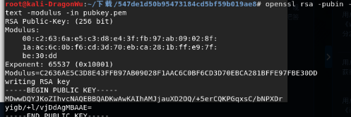
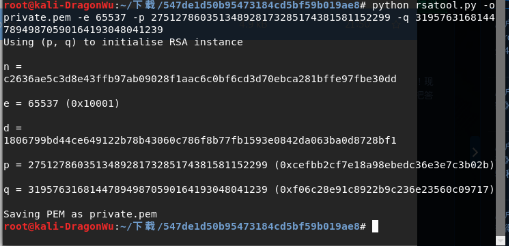

# Normal_RSA

## 题目

见附件flag.enc与pubkey.pem

## 解法

题目所给的为.pem文件和一个flag.enc。OpenSSl使用PEM文件格式存储证书和密钥，可以通过kali自带的openssl对其进行信息的提取。

` openssl rsa -pubin -text -modulus -in -pubkey.pem`

此时就得到了e=65537与大素数乘积n=C2636AE5C3D8E43FFB97AB09028F1AAC6C0BF6CD3D70EBCA281BFFE97FBE30DD，再将其转化为十进制为**87924348264132406875276140514499937145050893665602592992418171647042491658461**。

然后利用[网站](factordb.com)对其进行质因数分解得到p、q分别为**275127860351348928173285174381581152299**和**319576316814478949870590164193048041239**。

再利用*rsatool*生成私钥文件
`python rsatool.py -o private.pem -e 65537 -p 275127860351348928173285174381581152299 -q 319576316814478949870590164193048041239`

最后利用生成的私钥解密flag.enc
` openssl rsautl -decrypt -in flag.enc -inkey private.pem`

得到最终答案**PCTF{256b_i5_m3dium}**