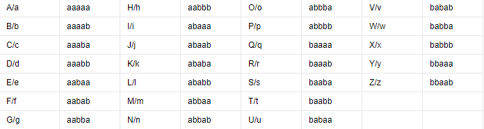

# 不仅仅是Morse

## 题目

--/.-/-.--/..--.-/-..././..--.-/..../.-/...-/./..--.-/.-/-./---/-/...././.-./..--.-/-.././-.-./---/-.././..../..../..../..../.-/.-/.-/.-/.-/-.../.-/.-/-.../-.../-.../.-/.-/-.../-.../.-/.-/.-/.-/.-/.-/.-/.-/-.../.-/.-/-.../.-/-.../.-/.-/.-/.-/.-/.-/.-/-.../-.../.-/-.../.-/.-/.-/-.../-.../.-/.-/.-/-.../-.../.-/.-/-.../.-/.-/.-/.-/-.../.-/-.../.-/.-/-.../.-/.-/.-/-.../-.../.-/-.../.-/.-/.-/-.../.-/.-/.-/-.../.-/.-/-.../.-/-.../-.../.-/.-/-.../-.../-.../.-/-.../.-/.-/.-/-.../.-/-.../.-/-.../-.../.-/.-/.-/-.../-.../.-/-.../.-/.-/.-/-.../.-/.-/-.../.-/.-/-.../.-/.-/.-/.-/-.../-.../.-/-.../-.../.-/.-/-.../-.../.-/.-/-.../.-/.-/-.../.-/.-/.-/-.../.-/.-/-.../.-/.-/-.../.-/.-/-.../.-/-.../.-/.-/-.../-.../.-/-.../.-/.-/.-/.-/-.../-.../.-/-.../.-/.-/-.../-.../.-

## 解法

观察到，如将“/”视作分隔符，那么字符串中就仅有两种字符“."与“-”，显然为摩斯密码，解码后可得**MAY_BE_HAVE_ANOTHER_DECODEHHHHAAAAABAABBBAABBAAAAAAAABAABABAAAAAAABBABAAABBAAABBAABAAAABABAABAAABBABAAABAAABAABABBAABBBABAAABABABBAAABBABAAABAABAABAAAABBABBAABBAABAABAAABAABAABAABABAABBABAAAABBABAABBA**

那么知道要将字符串AAAAABAABBBAABBAAAAAAAABAABABAAAAAAABBABAAABBAAABBAABAAAABABAABAAABBABAAABAAABAABABBAABBBABAAABABABBAAABBABAAABAABAABAAAABBABBAABBAABAABAAABAABAABAABABAABBABAAAABBABAABBA通过另一种方式解码。观察可知，该字符串只由A与B两种字母构成，而题目告诉我们这不再是摩斯密码，那么很自然就能够想到培根密码，观察培根密码表。

可知该字符串即为培根密码加密后结果，解码后可得**attackanddefenceworldisinteresting**