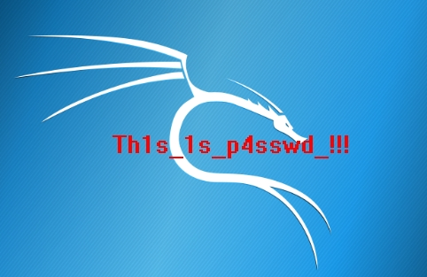

# 功夫再高也怕菜刀

## 题目

见附件kongfu.pcapng

## 解法

下载下来发现1k多组包但是有2M多，因此先用kali自带的foremost对其进行分离操作，发现有一个压缩包，而包内有一个需要密码解压缩的flag.txt。再回到kongfu.pcapng，用wireshark打开，并在分组详情内查询flag.txt，发现多个包含有flag.txt的数据，依次对其进行追踪TCP流发现在最后一个分组内有一个6666.jpg的文件，于是追踪出来流的结果(见附件tcp流7）中查找jpg的头标志*FFD8*与尾标志*FFD9*，利用010-editor对jpg进行还原，得到

因此得知压缩文件密码，进行解压即可获得flag:**flag{3OpWdJ-JP6FzK-koCMAK-VkfWBq-75Un2z}**